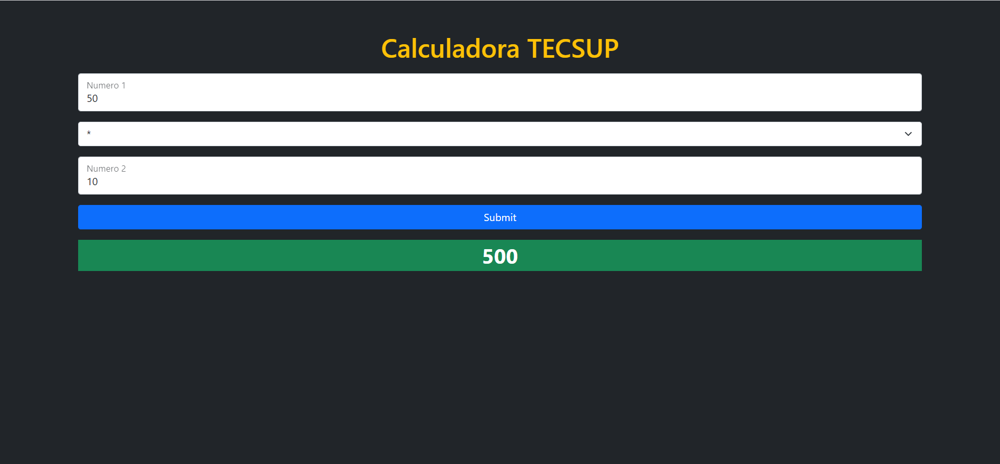

# [Calculadora Tecasup](https://josuecoder.github.io/Calculadora-tecsup/)|  | || |

[calculadora Tecsup](https://josuecoder.github.io/Calculadora-tecsup/)

### Calculadora Basica ,diseñado durante el Bootcamp FullStack de CodiGO.

## 🖥️Instalacion🖥️:
- Ubicarse en la carpeta que contendra el proyecto.
- Abrir la terminal de comandos.
  - git clone https://github.com/josueCoder/Calculadora-tecsup.git
  - cd Calculadora-tecsup.
  - Levantar la web en un servidor y disfrutar.
## 🧑‍💻Tecnologias usadas🧑‍💻
| HTML | Bootstrap | JS | 
| --- | --- | --- |
| |  | |   

  Desarrollado por 🧑‍💻Rody Josue🧑‍💻&copy;2022

